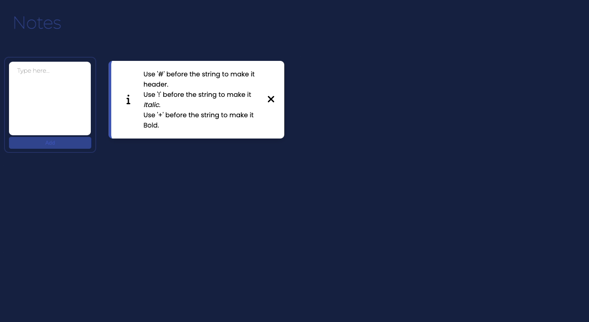
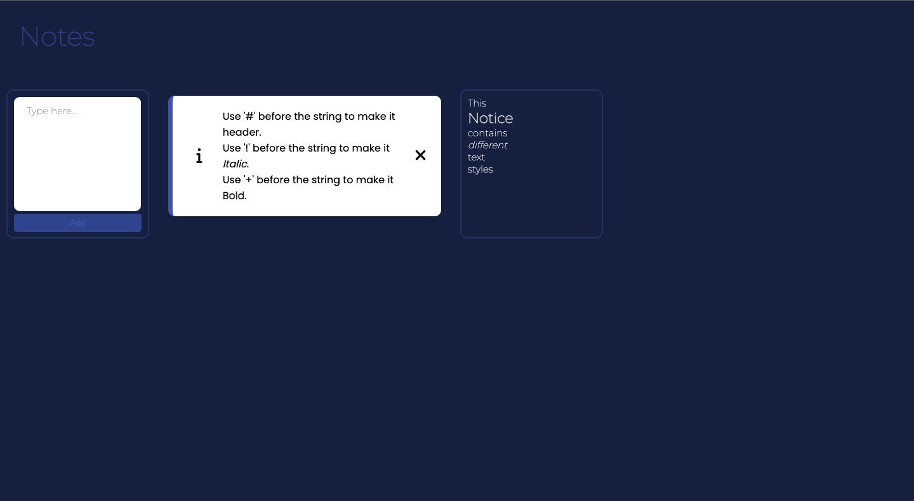

# Notes

## Table of contents

- [Overview](#overview)
  - [The challenge](#the-challenge)
  - [Screenshot](#screenshot)
- [My process](#my-process)
  - [Built with](#built-with)
  - [What I learned](#what-i-learned)
- [Author](#author)

## Overview

### The challenge

Users should be able to:

- Add note
- Change text styles
- Save notes
- Delete notes

### Screenshot

#### Clear page



#### Page with notice



## My process

### Built with

- Semantic HTML5 markup
- CSS custom properties
- CSS Grid
- Mobile-first workflow
- JavaScript
- Local storage

### What I learned

To save notes I learned local storage

```js
   localStorage.setItem(`${keyI}`, notice);
```


